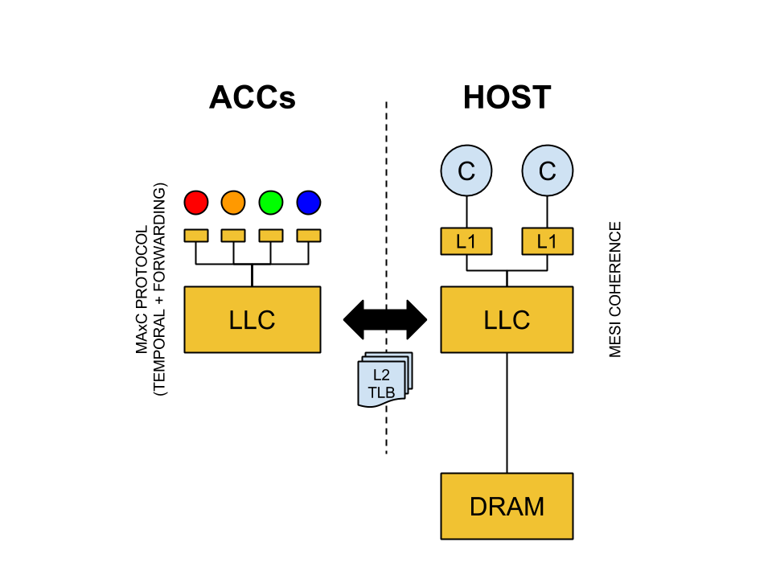

## MAxC - A Many Accelerator Coherence Protocol
### Motivation  
In systems with accelerators, The  acceleratable kernel has to be first brought in, from memory to the cache of the Accelerators.
Moreover, for an accelerator to realize any performance gain and hide this memory latency, the size of the acceleratable part of a program should be large.
But there exists parts of the program which is acceleratble and not large enough for existing accelerators ( like GPU's) to exploit.
The idea is to have multiple light wight acclerators which can work on various small acceleratable kernels, which are not accleratable on traditional accelerators like GPU's.

We propose to have a coherence protocol for the accelerators (ACC) which can be used to accelerate small parts of a program.
The design consists of many accelerators which will have there own private caches(sector caches) and a shared L2-cache (ACC-L2). 
The shared ACC-L2 will be  integrated with the L2 of the main core. 

When  a section of the code is detected as acceleratable, the main core will issue an instruction to copy the related data from Main core's L2 to ACC-L2, and 
will switch to another process. Then an ACC will be assigned by the main core to accelerate the kernel. 
The assigned ACC will then inform the time it will take to do the compute and give a time count to ACC-L2, which will lock the data until that time.

### Design Features
ACC's will have self invalidation and use L2's tlb.
The traditional ACC uses scracth pad, where we will be using Sector caches (private L1).

The type of kernels that will run on ACC.
Type 1 Separate Kernels
Type 2 Separate iterations of same kernel
Type 3 Pipelined kernels - like FFT, where ACC's can use forwarding to transfer data amongst them without copying data back and forth from caches.

### Contributions:-
1. The Organization of ACC's - 
2. The Organization of Ld/St 
3. Fine grained mem ops in ACC i.e ACC will be capable of issuing memory instructions on its own -:
        For example, a program's resource allocation has the following pattern :-
        acc1 ->acc2 ->cpu -> acc3
        Curently, the processor is involved in every memory interaction, since the accelerator does not have a Ld/St unit. 
        So the main core has to gather data and put it in the cache of acc before acc can start compute.
4. Pipelining (optional) - Pipelining the ACC's, So that ACC's running various sections of the code, can forward data without copying back and forth to caches.
5. Granularity (optional) - It is part of (2) having different blocks for ACC (private L1 - 32bytes per block) and ACC-L2 (64 bytes per block).

### Accelerator Blocks
1. Compress / Deflate
2. Matrix / Vector Operations
3. Cryptographic Functions
4. Checksum / Digest / CRC
5. Stencil Patterns 
